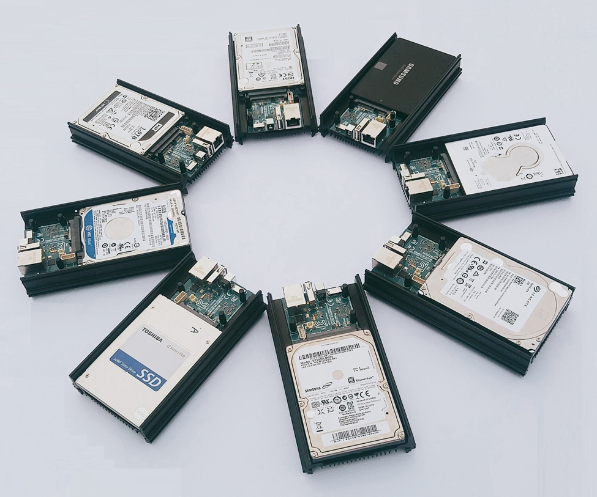

Storage Area Network
====================

I wanted my cloud to be made up of SBC computers, and was challenged when approaching the SAN, that was until I stumbled across the Hardkernel ODROID `HC1 <https://www.hardkernel.com/shop/odroid-hc1-home-cloud-one/>`_ and `HC2 <https://www.hardkernel.com/shop/odroid-hc2-home-cloud-two/>`_.

The most basic way to describe it is a SATA connection with an Ethernet port, and a tiny computer in the middle, that is capable of running `Ubuntu 18.04 <https://wiki.odroid.com/odroid-xu4/os_images/linux/ubuntu_4.14/ubuntu_4.14>`_.

At the time of writing, this was also not that expensive at $49 and an additional $5.50 for the power supply (5v 4A). Being stackable, made it a bonus, just keep in mind, from my current experiences with it, the aluminum case is definately getting warm, but keeps it somewhat cool, a fan blowing across it is probably a good idea for the final deployments.

Quick Test
**********

I wanted to just get something up, and mount an iSCSI disk on my laptop hosted from the HC1, this was the commands I used, step by step.

Flash an image and boot
------------------------

The HC1 has an SD card it boots from, and space for a 2.5" SATA. I downloaded the image that ODROID recommended `Ubuntu 18.04.3 LTS <https://odroid.in/ubuntu_18.04lts/XU3_XU4_MC1_HC1_HC2/ubuntu-18.04.3-4.14-minimal-odroid-xu4-20190910.img.xz>`_ that is specific for the XU3/XU4/MC1/HC1/HC2.

Next, as with most of my SD cards, I just used `Balena Etcher <https://www.balena.io/etcher/>`_ to burn the image.

With that out of the way, tossing in the SD card, a random 7800 RPM WD 1TB I had laying around from an old laptop, I popped in the power cable and did the first boot. If you haven't noticed yet, this is a headless device, there is no video output at all.

Initial Server Setup
--------------------

Now it's time to login and do some basic house cleaning to configure the server for my home network and user.

First, I need to find the IP, its easy for me, a simple webpage load on my UniFi, and I can find the new system, however, you can also utilize linux to find it:

.. code-block:: bash

   sudo nmap -p 22 192.168.1.0/24 | grep odroid

This will output something similar to:

.. code-block:: console

   Nmap scan report for odroid (192.168.1.152)

Now you can SSH into it with:

.. code-block:: bash

   ssh root@192.168.1.152

Replacing the IP you found instead of mine and using password ``odroid``

One really annoying thing I learned about a basic Ubuntu was that arrow keys did wierd things (print ascii characters like abcd), so this will fix that.

.. code-block:: bash

   echo set nocompatable >> ./.exrc

Setting the hostname on Ubuntu 18.x isn't super straight forward, but these two items will do it, for the remainder, the hostname will be ``odroid-hc1-01``

.. code-block:: bash

   hostnamectl set-hostname odroid-hc1-01

Then modify the ``/etc/hosts`` file with :command:`vi` to change the value for localhost:

.. code-block:: console

   127.0.0.1       odroid-hc1-01
   127.0.0.1       localhost
   ::1             localhost ip6-localhost ip6-loopback
   ff02::1         ip6-allnodes
   ff02::2         ip6-allrouters

Add the user and give it SUDO permissions not requiring a password - keep in mind, my username is ``renevo``, use your own.

.. code-block:: bash

   adduser renevo
   usermod -aG sudo renevo
   echo "renevo ALL=(ALL) NOPASSWD:ALL" | tee /etc/sudoers.d/renevo

From my workstation, I then copied over my SSH key so I didn't need to use a password:

.. code-block:: bash

   ssh-copy-id 192.168.1.152

Now the server is ready for the first reboot with all the user configurations and hostname:

.. code-block:: bash

   shutdown -r now

Giving it a few, as it can take a bit, SSH back into the server as the user created above.

Once in, I secure things up a bit more with SSH and the root login.

Disable root password

.. code-block:: bash

   sudo passwd -l root

These settings will make things a bit more secure, and stop root from logging in.

.. code-block:: bash

   sudo nano /etc/ssh/sshd_config

And change the following settings (or uncomment them)

.. code-block:: cfg

   PermitRootLogin no
   PasswordAuthentication no
   PubkeyAuthentication yes

Restart SSH service:

.. code-block:: bash

   sudo systemctl restart ssh

Update and upgrade all the current packages (may require restart)

.. code-block:: bash

   sudo apt-get update && sudo apt-get upgrade

Install VIM and use a better color scheme:

.. code-block:: bash

   sudo apt-get install vim
   echo 'colorscheme desert' >> ~/.vimrc

Configure the SATA Drive
------------------------

.. todo:: Content here

Create an iSCSI Target
----------------------

.. todo:: Content here

Mount and format on Windows
---------------------------

.. todo:: Content here

Cleanup
-------

.. todo:: Content here

What I learned from this
------------------------

.. todo:: Content here

